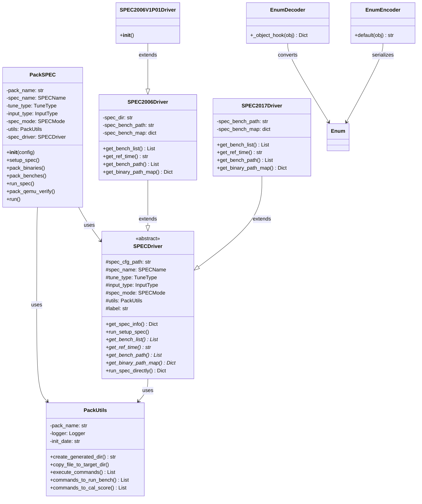
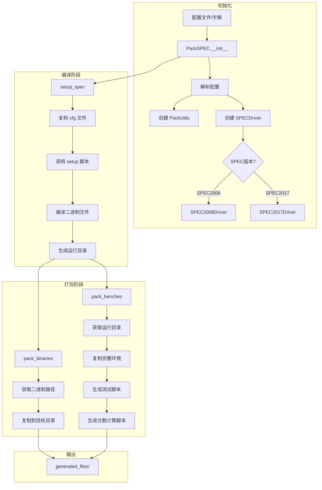
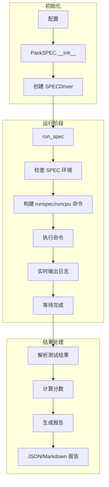
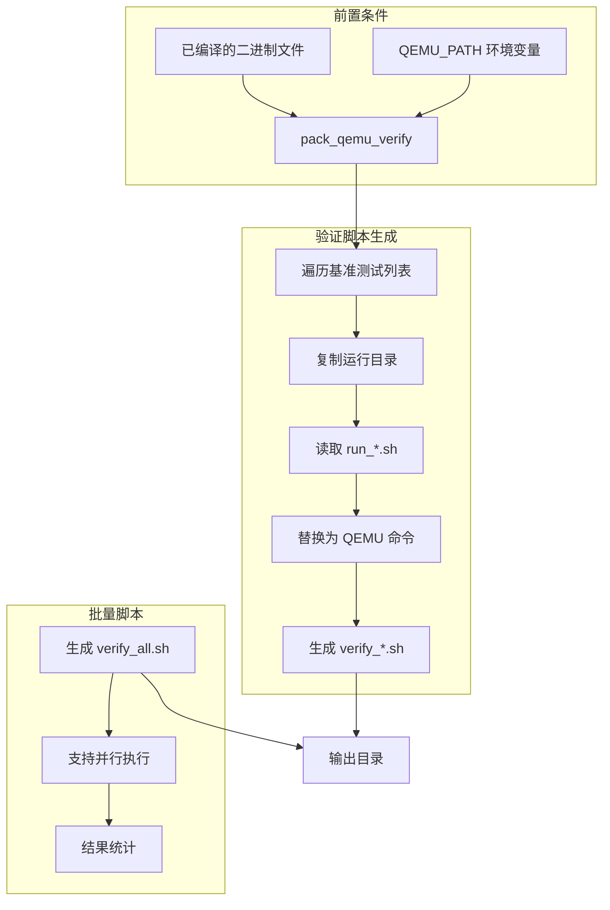

# PackSPEC 系统架构文档

本文档描述 PackSPEC 工具的整体架构设计，包括模块职责、类关系和数据流。

---

## 1. 系统概述

PackSPEC 是一个 SPEC CPU 基准测试打包工具，支持 SPEC2006 和 SPEC2017 两个版本。主要功能包括：

- **编译管理**：调用 SPEC 的 setup 脚本进行基准测试编译
- **打包输出**：将编译后的二进制文件和运行环境打包到指定目录
- **脚本生成**：自动生成测试运行脚本、分数计算脚本和验证脚本
- **直接运行**：支持直接调用 runspec/runcpu 命令执行测试

---

## 2. 模块职责

### 2.1 模块结构

```
src/pack_spec/
├── __init__.py          # 包入口，导出公共 API
├── pack_config.py       # 配置模块：枚举类型、异常类、全局常量
├── pack_spec.py         # 主模块：PackSPEC 核心类
├── pack_utils.py        # 工具模块：文件操作、脚本生成、命令执行
├── spec_driver.py       # 驱动基类：SPEC 操作的抽象接口
├── spec_2006_driver.py  # SPEC2006 驱动：SPEC2006 特定实现
└── spec_2017_driver.py  # SPEC2017 驱动：SPEC2017 特定实现
```

### 2.2 模块职责说明

| 模块 | 职责 | 依赖 |
|------|------|------|
| `pack_config.py` | 定义全局配置、枚举类型、异常类、日志消息 | 无 |
| `pack_utils.py` | 提供文件操作、脚本生成、命令执行等工具方法 | pack_config |
| `spec_driver.py` | 定义 SPEC 驱动基类，提供通用操作接口 | pack_config, pack_utils |
| `spec_2006_driver.py` | 实现 SPEC2006 特定操作 | spec_driver |
| `spec_2017_driver.py` | 实现 SPEC2017 特定操作 | spec_driver |
| `pack_spec.py` | 核心入口类，协调各模块完成打包任务 | 所有模块 |

---

## 3. 类关系图



---

## 4. 数据流图

### 4.1 打包模式数据流



### 4.2 直接运行模式数据流



### 4.3 QEMU 验证模式数据流



---

## 5. 核心流程说明

### 5.1 初始化流程

1. **配置加载**：支持从配置文件路径或配置字典初始化
2. **参数解析**：提取 task、spec_config、pack_config 等配置块
3. **驱动选择**：根据 `spec_name` 创建对应的 SPECDriver 实例
4. **工具初始化**：创建 PackUtils 实例用于后续操作

### 5.2 编译流程 (setup_spec)

1. **保护源文件**：将 cfg 文件复制到 generated_files 目录
2. **调用外部脚本**：执行 setup-spec06.sh 或 setup-spec17.sh
3. **实时输出**：捕获并输出编译过程日志
4. **错误处理**：检查返回码，失败时抛出 CommandExecutionError

### 5.3 打包流程 (pack_binaries / pack_benches)

1. **路径获取**：通过 SPECDriver 获取二进制文件或运行目录路径
2. **目录创建**：在 generated_files 下创建目标目录
3. **文件复制**：使用 shutil.copytree 复制完整目录结构
4. **脚本生成**：
   - `run_{input_type}.sh`：基准测试运行脚本
   - `test_{input_type}.sh`：测试执行脚本（含分数计算）
   - `specdiff_{input_type}.sh`：输出验证脚本
   - `specdiff_{input_type}_all.sh`：批量输出验证脚本

### 5.4 直接运行流程 (run_spec)

1. **环境检查**：验证 SPEC 安装目录和命令可用性
2. **命令构建**：根据配置构建 runspec/runcpu 命令
3. **执行监控**：实时输出日志，支持 Ctrl+C 中断
4. **结果解析**：从 .sum 文件解析测试结果
5. **报告生成**：生成 JSON 或 Markdown 格式的测试报告

---

## 6. 目录结构

### 6.1 项目目录

```
pack_spec/
├── src/pack_spec/           # 源代码目录
├── tests/                   # 测试目录
├── scripts/                 # 外部脚本（setup-spec*.sh）
├── docs/                    # 文档目录
├── generated_files/         # 生成的配置和输出
├── packed_files/            # 打包输出目录
├── .env                     # 环境变量配置
├── .env.example             # 环境变量示例
├── main.py.example          # 使用示例
└── README.md                # 项目说明
```

### 6.2 生成目录结构

```
generated_files/
├── {date}_{pack_name}/      # 非自动模式
│   ├── {date}_{pack_name}.json  # 配置文件
│   ├── cfg/                 # 配置文件副本
│   ├── log/                 # 日志文件
│   ├── spec_results/        # 直接运行SPEC测试结果目录
│   │   └── run_{timestamp}/ # 单次运行结果
│   ├── bin/                 # 二进制文件
│   │   └── {date}_{spec_name}_bin_{pack_name}.{tune}_{input}_{mode}/
│   └── run/                 # 运行环境
│       └── {date}_{spec_name}_run_{pack_name}.{tune}_{input}_{mode}/
│           ├── {bench_name}/
│           │   ├── run_{input}.sh
│           │   ├── test_{input}.sh
│           │   └── ...
│           └── test_{input}_all.sh
└── {pack_name}/             # 自动模式（无日期前缀）
    ├── {pack_name}.json     # 配置文件
    ├── spec_results/        # 直接运行SPEC测试结果目录
    │   └── run_{timestamp}/ # 单次运行结果
    ├── bin/
    │   └── {spec_name}_bin_{pack_name}.{tune}_{input}_{mode}/
    └── run/
        └── {spec_name}_run_{pack_name}.{tune}_{input}_{mode}/
```

---

## 7. 配置体系

### 7.1 配置来源

| 来源 | 优先级 | 说明 |
|------|--------|------|
| 环境变量 (.env) | 高 | SPEC 路径、LLVM 路径、钉钉配置 |
| 配置文件/字典 | 中 | 任务配置、SPEC 配置、打包配置 |
| 默认值 | 低 | 代码中定义的默认值 |

### 7.2 配置结构

```python
{
    "task": {
        "pack_name": "my_test",
        "setup_spec": False,
        "pack_binaries": True,
        "pack_benches": True,
        "run_mode": "pack"
    },
    "spec_config": {
        "spec_cfg_path": "/path/to/spec.cfg",
        "spec_name": SPECName.spec2017,
        "tune_type": TuneType.base,
        "input_type": InputType.ref,
        "spec_mode": SPECMode.speed,
        "spec_benches": "all",
        "iterations": 3
    },
    "pack_config": {
        "test_core_num": 4,
        "test_clock_rate": 1.0,
        "profile_gen": False,
        "auto_mode": False,
        "verify_mode": False,
        "minimal_mode": False
    },
    "msg_config": {
        "enable_dingtalk_message": False,
        "log_language": "zh"
    }
}
```

---

## 8. 扩展点

### 8.1 新增 SPEC 版本

1. 创建新的驱动类继承 `SPECDriver`
2. 实现抽象方法：`get_bench_list()`, `get_ref_time()`, `get_bench_path()`, `get_binary_path_map()`
3. 在 `PackSPEC.init_pack_spec()` 中添加版本判断分支
4. 在 `SPECName` 枚举中添加新版本

### 8.2 新增打包模式

1. 在 `PACKMode` 枚举中添加新模式
2. 在 `PackUtils.get_dest_dir()` 中处理新模式
3. 在 `PackSPEC` 中添加对应的打包方法

### 8.3 新增报告格式

1. 在 `pack_utils.py` 中添加报告生成函数
2. 在 `PackSPEC.run_spec()` 中添加格式判断分支

---

## 9. 依赖关系

### 9.1 外部依赖

| 依赖 | 用途 |
|------|------|
| loguru | 日志记录 |
| python-dotenv | 环境变量加载 |
| pytest | 单元测试 |

### 9.2 系统依赖

| 依赖 | 用途 |
|------|------|
| SPEC CPU 2006/2017 | 基准测试套件 |
| bash | 脚本执行 |
| curl | 消息发送（可选） |
| QEMU | 验证模式（可选） |
