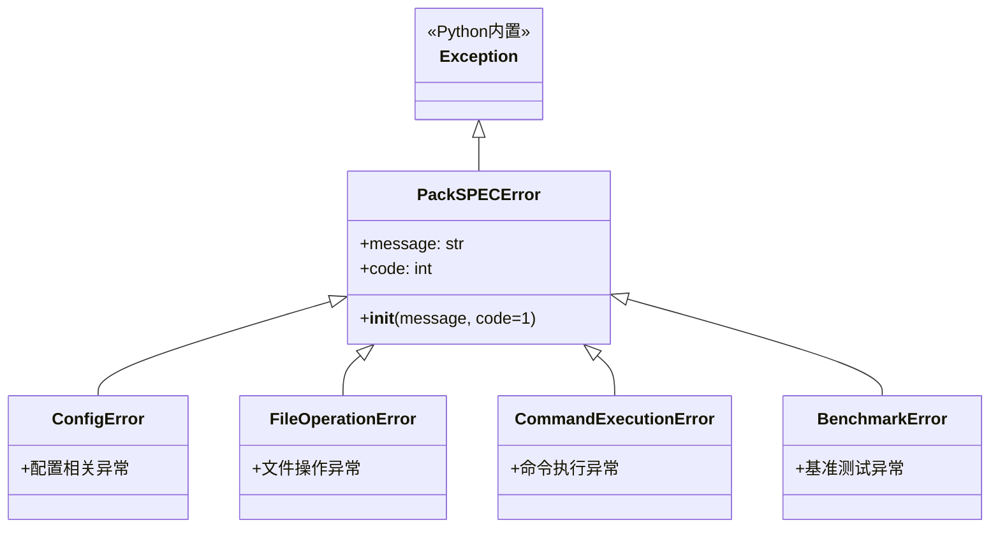
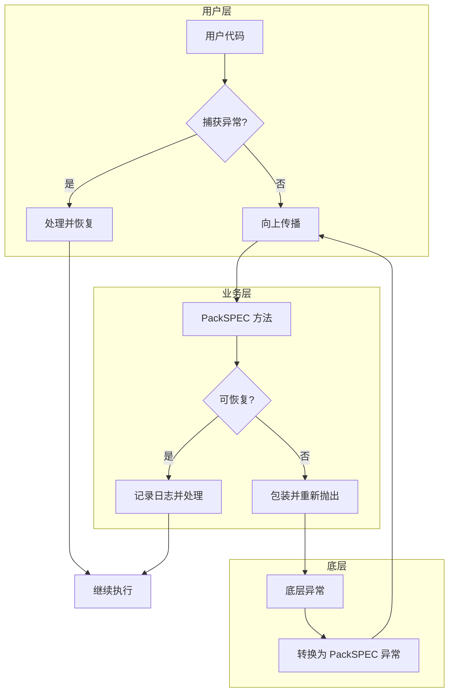

# PackSPEC 异常处理策略文档

本文档描述 PackSPEC 工具的异常层次结构、处理策略和错误恢复机制。

---

## 1. 异常层次结构

PackSPEC 定义了完整的异常层次结构，所有自定义异常都继承自 `PackSPECError` 基类。



---

## 2. 异常类详细说明

### 2.1 PackSPECError（基础异常类）

所有 PackSPEC 异常的基类，提供统一的异常接口。

| 属性 | 类型 | 说明 |
|------|------|------|
| `message` | str | 异常消息，描述错误详情 |
| `code` | int | 异常代码，默认为 1，可用于程序退出码 |

**使用示例：**

```python
from pack_spec.pack_config import PackSPECError

try:
    raise PackSPECError("操作失败", code=2)
except PackSPECError as e:
    print(f"错误: {e.message}, 代码: {e.code}")
```

### 2.2 ConfigError（配置异常）

配置加载、验证、解析过程中的错误。

**触发场景：**

| 场景 | 说明 |
|------|------|
| 配置文件不存在 | `load_pack_spec_cfg()` 找不到配置文件 |
| 配置格式错误 | JSON 解析失败 |
| 必需字段缺失 | 配置字典缺少必需的字段 |
| QEMU 未配置 | 开启验证模式但未设置 QEMU_PATH |

**处理策略：**

```python
try:
    config = load_pack_spec_cfg(path)
except ConfigError as e:
    logger.error(f"配置错误: {e.message}")
    sys.exit(e.code)
```

### 2.3 FileOperationError（文件操作异常）

文件复制、创建、删除、读取等操作中的错误。

**触发场景：**

| 场景 | 说明 |
|------|------|
| 源文件不存在 | `copy_file_to_target_dir()` 源文件缺失 |
| 目录创建失败 | 权限不足或路径无效 |
| 没有文件可复制 | `copy_binaries()` 未找到任何二进制文件 |
| 基准测试目录未找到 | `get_bench_dir()` 无法匹配目录 |
| 参考时间文件缺失 | `get_ref_time()` 无法读取 reftime 文件 |

**处理策略：**

```python
try:
    dest_dir = utils.create_dest_dir(...)
except FileOperationError as e:
    logger.error(f"文件操作失败: {e.message}")
    # 检查路径权限或磁盘空间
```

### 2.4 CommandExecutionError（命令执行异常）

外部命令执行过程中的错误。

**触发场景：**

| 场景 | 说明 |
|------|------|
| setup 脚本失败 | `run_setup_spec()` 返回非零退出码 |
| specinvoke 失败 | `execute_commands()` 命令执行错误 |
| runspec/runcpu 失败 | `run_spec_directly()` 测试执行失败 |
| 脚本创建失败 | `use_template_to_create_script()` 模板处理错误 |

**处理策略：**

```python
try:
    spec_driver.run_setup_spec(tune_type, input_type)
except CommandExecutionError as e:
    logger.error(f"命令执行失败: {e.message}")
    # 检查日志文件获取详细错误信息
    # 可能需要检查 SPEC 环境配置
```

### 2.5 BenchmarkError（基准测试异常）

基准测试选择、运行、验证等过程中的错误。

**触发场景：**

| 场景 | 说明 |
|------|------|
| 未选择任何基准测试 | `get_bench_list()` 返回空列表 |
| 基准测试编号无效 | 指定的编号不存在于基准测试列表 |
| 二进制文件未找到 | `get_binary_path_map()` 无法定位二进制文件 |

**处理策略：**

```python
try:
    bench_list = driver.get_bench_list()
except BenchmarkError as e:
    logger.error(f"基准测试错误: {e.message}")
    # 检查 spec_benches 参数是否正确
```

---

## 3. 异常处理策略

### 3.1 分层处理原则



### 3.2 异常转换规则

底层异常在传播到上层时会被转换为对应的 PackSPEC 异常：

| 底层异常 | 转换为 | 场景 |
|----------|--------|------|
| `FileNotFoundError` | `ConfigError` | 配置文件不存在 |
| `json.JSONDecodeError` | `ConfigError` | JSON 解析失败 |
| `shutil.Error` | `FileOperationError` | 文件复制失败 |
| `subprocess.CalledProcessError` | `CommandExecutionError` | 命令执行失败 |
| `PermissionError` | `FileOperationError` | 权限不足 |
| `OSError` | `FileOperationError` | 文件系统错误 |

### 3.3 异常处理模式

#### 模式 1：记录并重新抛出

```python
try:
    result = subprocess.run(cmd, check=True, capture_output=True)
except subprocess.CalledProcessError as e:
    logger.error(f"命令执行失败: {e.stderr}")
    raise CommandExecutionError(f"命令执行失败: {e.stderr}")
```

#### 模式 2：记录并返回默认值

```python
try:
    with open(reftime_path, 'r') as f:
        return f.readline().strip()
except Exception as e:
    logger.warning(f"无法读取参考时间: {e}")
    return ""
```

#### 模式 3：条件恢复

```python
try:
    os.makedirs(dest_dir)
except FileExistsError:
    if auto_mode:
        logger.info("目录已存在，自动模式下继续")
    else:
        raise FileOperationError("目录已存在")
```

---

## 4. 错误恢复机制

### 4.1 配置错误恢复

| 错误类型 | 恢复策略 |
|----------|----------|
| 配置文件不存在 | 提示用户检查路径，退出程序 |
| 字段缺失 | 使用默认值并记录警告 |
| 枚举值无效 | 提示有效选项，退出程序 |

### 4.2 文件操作错误恢复

| 错误类型 | 恢复策略 |
|----------|----------|
| 目标目录已存在 | 提示用户确认覆盖（非自动模式）或自动覆盖（自动模式） |
| 源文件不存在 | 记录警告，跳过该文件，继续处理其他文件 |
| 权限不足 | 提示用户检查权限，退出程序 |

### 4.3 命令执行错误恢复

| 错误类型 | 恢复策略 |
|----------|----------|
| setup 脚本失败 | 记录详细日志，提示用户检查 SPEC 环境和配置文件 |
| runspec/runcpu 失败 | 保存部分结果，生成错误报告 |
| 用户中断 (Ctrl+C) | 清理临时文件，保存当前进度 |

### 4.4 基准测试错误恢复

| 错误类型 | 恢复策略 |
|----------|----------|
| 未选择基准测试 | 提示有效的选择格式，退出程序 |
| 部分基准测试缺失 | 记录警告，继续处理存在的基准测试 |
| 二进制文件缺失 | 记录警告，跳过该基准测试 |

---

## 5. 日志记录策略

### 5.1 日志级别使用

| 级别 | 使用场景 |
|------|----------|
| DEBUG | 详细的执行流程、路径信息、中间结果 |
| INFO | 主要操作步骤、配置信息、进度信息 |
| WARNING | 可恢复的问题、跳过的操作、非关键错误 |
| ERROR | 操作失败、异常抛出前的错误信息 |
| SUCCESS | 操作成功完成 |

### 5.2 异常日志格式

```python
# 异常抛出前记录
logger.error(f"操作失败: {details}")
raise OperationError(f"操作失败: {details}")

# 异常捕获时记录
except OperationError as e:
    logger.error(f"捕获到异常: {e.message}")
    # 处理或重新抛出
```

### 5.3 日志文件位置

```
generated_files/
└── {pack_name}/
    └── log/
        └── PackSpec_{timestamp}.log
```

---

## 6. 用户交互处理

### 6.1 确认提示

在非自动模式下，某些操作需要用户确认：

```python
if not auto_mode:
    choice = input("是否继续? (y/n): ")
    if choice.lower() != 'y':
        raise PackSPECError("用户取消了操作")
```

### 6.2 错误消息国际化

所有错误消息通过 `LogMessages` 类支持中英文：

```python
# 中文
raise ConfigError(self.msg.get("config_file_not_found", path=path))

# 英文（根据 log_language 配置）
raise ConfigError(self.msg.get("config_file_not_found", path=path))
```

---

## 7. 最佳实践

### 7.1 异常处理建议

1. **具体异常优先**：捕获具体的异常类型而非通用的 `Exception`
2. **保留上下文**：在重新抛出异常时保留原始错误信息
3. **合理使用日志**：在异常抛出前记录足够的调试信息
4. **避免静默失败**：不要捕获异常后不做任何处理

### 7.2 错误消息编写

```python
# 好的错误消息
raise FileOperationError(
    f"无法复制文件 '{src}' 到 '{dest}': 权限不足"
)

# 不好的错误消息
raise FileOperationError("复制失败")
```

### 7.3 资源清理

使用 `try-finally` 确保资源正确释放：

```python
process = None
try:
    process = subprocess.Popen(cmd, ...)
    # 处理输出
finally:
    if process and process.stdout:
        process.stdout.close()
```

---

## 8. 异常代码参考

| 代码 | 含义 |
|------|------|
| 1 | 通用错误（默认） |
| 2 | 配置错误 |
| 3 | 文件操作错误 |
| 4 | 命令执行错误 |
| 5 | 基准测试错误 |
| 130 | 用户中断 (SIGINT) |
