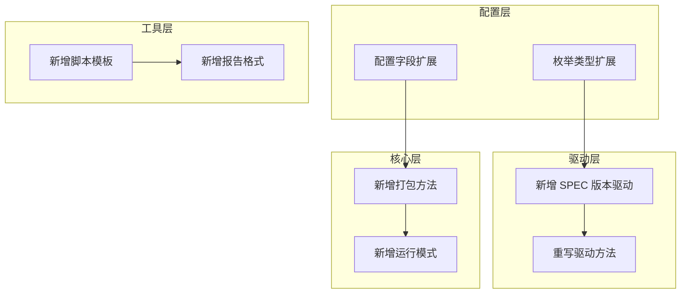

# PackSPEC 扩展性设计文档

本文档描述 PackSPEC 工具的扩展点设计，包括如何新增 SPEC 版本支持、新增打包模式和自定义扩展。

---

## 1. 系统扩展点概述

PackSPEC 采用模块化设计，提供多个扩展点以支持功能扩展：



---

## 2. 新增 SPEC 版本

### 2.1 步骤概览

| 步骤 | 文件 | 说明 |
|------|------|------|
| 1 | `pack_config.py` | 添加版本枚举值 |
| 2 | `spec_xxxx_driver.py` | 创建驱动类 |
| 3 | `pack_spec.py` | 添加版本判断分支 |
| 4 | `tests/` | 添加单元测试 |

### 2.2 详细步骤

#### 步骤 1：添加版本枚举

在 `pack_config.py` 的 `SPECName` 枚举中添加新版本：

```python
class SPECName(Enum):
    spec2006 = 1
    spec2006v1p01 = 2
    spec2017 = 3
    spec2024 = 4  # 新增版本
```

#### 步骤 2：添加环境变量配置

在 `pack_config.py` 中添加新版本的路径配置：

```python
SPEC2024_PATH = os.getenv('SPEC2024_PATH')
"""SPEC2024安装目录路径，从环境变量获取"""

if SPEC2024_PATH != None:
    SPEC2024_BENCH_PATH = os.path.join(SPEC2024_PATH, "benchspec", "CPU2024")
    """SPEC2024基准测试目录路径"""
    SPEC2024_CONFIG_PATH = os.path.join(SPEC2024_PATH, "config")
    """SPEC2024配置文件目录路径"""
else:
    SPEC2024_BENCH_PATH = None
    SPEC2024_CONFIG_PATH = None
```

#### 步骤 3：创建驱动类

创建 `spec_2024_driver.py` 文件：

```python
"""
SPEC CPU 2024基准测试驱动模块

本模块实现了SPEC CPU 2024基准测试的具体驱动功能，继承自SPECDriver基类。
"""

import os
from src.pack_spec.pack_config import (
    SPECName, TuneType, InputType, SPECMode, ActionType,
    FileOperationError, BenchmarkError,
    SPEC2024_PATH, SPEC2024_BENCH_PATH, SCRIPTS_PATH, logger
)
from .spec_driver import SPECDriver
from src.pack_spec.pack_utils import PackUtils, is_numeric
from typing import List, Dict


# SPEC2024基准测试列表
SPEC2024_INT_BENCHES = ["600.perlbench_s", ...]
"""SPEC2024整数基准测试列表"""

SPEC2024_FP_BENCHES = ["603.bwaves_s", ...]
"""SPEC2024浮点基准测试列表"""

SPEC2024_BENCHES = SPEC2024_INT_BENCHES + SPEC2024_FP_BENCHES
"""SPEC2024完整基准测试列表"""

SPEC2024_BIN_MAP = {
    "600.perlbench_s": "perlbench_s",
    ...
}
"""SPEC2024基准测试名称到二进制文件名的映射"""


class SPEC2024Driver(SPECDriver):
    """
    SPEC CPU 2024基准测试驱动类
    
    实现SPEC2024基准测试的具体操作。
    """
    
    def __init__(self, 
                 spec_cfg_path: str,
                 tune_type: TuneType, 
                 input_type: InputType, 
                 spec_mode: SPECMode,
                 spec_benches: str,
                 utils: PackUtils,
                 iterations: int = 3,
                 rebuild: bool = False,
                 ):
        """初始化SPEC2024Driver实例"""
        super().__init__(spec_cfg_path, SPECName.spec2024, 
                        tune_type, input_type, spec_mode, 
                        spec_benches, utils, iterations, rebuild)
        self.spec_dir = SPEC2024_PATH
        self.spec_bench_path = SPEC2024_BENCH_PATH
        self.spec_bench_map = SPEC2024_BIN_MAP
        self.spec_build_dir = 'build'
        self.spec_run_dir = 'run'
        self.setup_script_path = os.path.join(SCRIPTS_PATH, "setup-spec24.sh")
        self.spec_bench_list = self.get_bench_list()
    
    def get_bench_list(self) -> List[str]:
        """根据spec_benches字符串获取基准测试列表"""
        spec_bench_set = set()
        for bench in self.spec_benches.split():
            if bench == "all":
                spec_bench_set.update(SPEC2024_BENCHES)
            elif bench == "int":
                spec_bench_set.update(SPEC2024_INT_BENCHES)
            elif bench == "fp":
                spec_bench_set.update(SPEC2024_FP_BENCHES)
            else:
                for spec_bench in SPEC2024_BENCHES:
                    if bench == spec_bench.split('.')[0]:
                        spec_bench_set.add(spec_bench)
        
        spec_bench_list = sorted(spec_bench_set, 
            key=lambda x: (0 if x in SPEC2024_INT_BENCHES else 1, x))
        
        if not spec_bench_list:
            raise BenchmarkError(f"未选择任何基准测试: {self.spec_benches}")
        
        return spec_bench_list
    
    def get_ref_time(self, bench_name: str, input_type: InputType) -> str:
        """获取基准测试的参考时间"""
        # 实现参考时间获取逻辑
        reftime_path = os.path.join(
            self.spec_bench_path, bench_name, "data", input_type.name, "reftime"
        )
        try:
            with open(reftime_path, 'r') as f:
                return f.readline().strip()
        except Exception as e:
            raise FileOperationError(f"无法读取参考时间: {reftime_path}")
    
    def get_bench_path(self, action_type: ActionType, tune_type: TuneType, 
                       input_type: InputType, spec_mode: SPECMode) -> List[str]:
        """获取基准测试的构建或运行目录路径列表"""
        # 实现目录路径获取逻辑
        # 参考 SPEC2017Driver.get_bench_path() 实现
        pass
    
    def get_binary_path_map(self, tune_type: TuneType, input_type: InputType, 
                            spec_mode: SPECMode) -> Dict[str, str]:
        """获取基准测试二进制文件的路径映射"""
        # 实现二进制路径获取逻辑
        pass
    
    def _build_run_command(self) -> List[str]:
        """构建SPEC2024运行命令"""
        runcpu = os.path.join(self.spec_dir, "bin", "runcpu")
        cmd = [runcpu]
        # 构建命令参数
        return cmd
```

#### 步骤 4：在 PackSPEC 中集成

在 `pack_spec.py` 的 `init_pack_spec()` 方法中添加版本判断：

```python
from src.pack_spec.spec_2024_driver import SPEC2024Driver

# 在 init_pack_spec() 方法中
if self.spec_name == SPECName.spec2024:
    self.spec_driver = SPEC2024Driver(
        self.spec_cfg_path, self.tune_type, self.input_type,
        self.spec_mode, self.spec_benches, self.utils, 
        self.iterations, self.rebuild
    )
```

#### 步骤 5：更新环境变量示例

在 `.env.example` 中添加：

```bash
# SPEC2024安装路径
SPEC2024_PATH=/path/to/spec2024
```

---

## 3. 新增打包模式

### 3.1 步骤概览

| 步骤 | 文件 | 说明 |
|------|------|------|
| 1 | `pack_config.py` | 添加打包模式枚举 |
| 2 | `pack_utils.py` | 更新目录命名逻辑 |
| 3 | `pack_spec.py` | 添加打包方法 |

### 3.2 示例：添加"仅配置"打包模式

#### 步骤 1：添加枚举值

```python
class PACKMode(Enum):
    bin = 1
    run = 2
    buildrun = 3
    config_only = 4  # 新增：仅打包配置文件
```

#### 步骤 2：更新目录命名

在 `PackUtils.get_dest_dir()` 中处理新模式：

```python
def get_dest_dir(self, profile_gen: bool, auto_mode: bool, pack_mode: PACKMode,
                 spec_name: SPECName, tune_type: TuneType, 
                 input_type: InputType, spec_mode: SPECMode) -> str:
    # ... 现有代码 ...
    
    if pack_mode == PACKMode.bin:
        subdir = "bin"
    elif pack_mode == PACKMode.run:
        subdir = "run"
    elif pack_mode == PACKMode.buildrun:
        subdir = "run"
    elif pack_mode == PACKMode.config_only:
        subdir = "config"  # 新增
```

#### 步骤 3：添加打包方法

```python
def pack_config_only(self) -> str:
    """
    仅打包配置文件
    
    将SPEC配置文件和相关日志复制到目标目录，不包含二进制文件或运行环境。
    
    Returns:
        str: 目标目录路径
    """
    dest_dir = self.utils.create_dest_dir(
        self.profile_gen, self.auto_mode, PACKMode.config_only,
        self.spec_name, self.tune_type, self.input_type, self.spec_mode
    )
    
    self.utils.copy_spec_cfg_and_logs_to_target_dir(
        self.spec_driver.spec_dir, self.spec_cfg_path,
        dest_dir, self.tune_type, self.input_type
    )
    
    return dest_dir
```

---

## 4. 新增报告格式

### 4.1 步骤概览

| 步骤 | 文件 | 说明 |
|------|------|------|
| 1 | `pack_utils.py` | 添加报告生成函数 |
| 2 | `pack_spec.py` | 添加格式判断分支 |

### 4.2 示例：添加 HTML 报告格式

#### 步骤 1：添加报告生成函数

```python
def generate_html_report(results: Dict, config: Dict, output_path: str) -> str:
    """
    生成HTML格式的测试报告
    
    Args:
        results (Dict): 测试结果字典
        config (Dict): 测试配置字典
        output_path (str): 输出文件路径
        
    Returns:
        str: 生成的报告文件路径
    """
    from datetime import datetime
    
    html_content = f"""
    <!DOCTYPE html>
    <html>
    <head>
        <title>SPEC CPU 测试报告</title>
        <style>
            body {{ font-family: Arial, sans-serif; margin: 20px; }}
            table {{ border-collapse: collapse; width: 100%; }}
            th, td {{ border: 1px solid #ddd; padding: 8px; text-align: left; }}
            th {{ background-color: #4CAF50; color: white; }}
        </style>
    </head>
    <body>
        <h1>SPEC CPU 测试报告</h1>
        <p>生成时间: {datetime.now().strftime('%Y-%m-%d %H:%M:%S')}</p>
        
        <h2>测试配置</h2>
        <ul>
            <li>SPEC版本: {config.get('spec_name', '')}</li>
            <li>优化级别: {config.get('tune_type', '')}</li>
            <li>输入类型: {config.get('input_type', '')}</li>
        </ul>
        
        <h2>测试结果</h2>
        <table>
            <tr>
                <th>类型</th>
                <th>分数</th>
            </tr>
            <tr>
                <td>整数测试 (INT)</td>
                <td>{results.get('int_score', 0):.2f}</td>
            </tr>
            <tr>
                <td>浮点测试 (FP)</td>
                <td>{results.get('fp_score', 0):.2f}</td>
            </tr>
        </table>
    </body>
    </html>
    """
    
    os.makedirs(os.path.dirname(output_path), exist_ok=True)
    
    with open(output_path, 'w', encoding='utf-8') as f:
        f.write(html_content)
    
    return output_path
```

#### 步骤 2：更新报告格式判断

```python
# 在 run_spec() 方法中
if self.report_format == "html":
    report_path = os.path.join(run_result["output_dir"], "spec_report.html")
    generate_html_report(results, config_info, report_path)
elif self.report_format == "markdown":
    report_path = os.path.join(run_result["output_dir"], "spec_report.md")
    generate_markdown_report(results, config_info, report_path)
else:
    report_path = os.path.join(run_result["output_dir"], "spec_report.json")
    generate_json_report(results, config_info, report_path)
```

---

## 5. 新增脚本模板

### 5.1 模板文件位置

脚本模板存放在 `scripts/` 目录，使用 `.template` 后缀：

```
scripts/
├── cal_score.py
├── cal_score_minimal.sh
├── merge_profile.sh.template
├── collect_profiles.sh.template
└── send_md_message.py
```

### 5.2 创建新模板

#### 步骤 1：创建模板文件

创建 `scripts/custom_script.sh.template`：

```bash
#!/bin/bash
# 自定义脚本模板

# 占位符将被替换
CONFIG_NAME="<config_name>"
BENCH_NAME="<bench_name>"

echo "Running $BENCH_NAME with config $CONFIG_NAME"
```

#### 步骤 2：使用模板

```python
self.utils.use_template_to_create_script(
    "custom_script.sh.template",
    dest_dir,
    {
        "<config_name>": self.spec_driver.label,
        "<bench_name>": bench_name
    }
)
```

---

## 6. 自定义驱动方法重写

### 6.1 重写参考时间获取

如果新版本的参考时间存储格式不同：

```python
def get_ref_time(self, bench_name: str, input_type: InputType) -> str:
    """
    获取基准测试的参考时间（自定义实现）
    """
    # 自定义的参考时间获取逻辑
    reftime_path = os.path.join(
        self.spec_bench_path, 
        bench_name, 
        "custom_data",  # 不同的目录结构
        input_type.name,
        "reference_time.txt"  # 不同的文件名
    )
    
    with open(reftime_path, 'r') as f:
        for line in f:
            if line.startswith(f"{input_type.name}_{self.spec_mode.name}"):
                return line.split()[1]
    
    raise FileOperationError(f"无法获取参考时间: {reftime_path}")
```

### 6.2 重写目录路径获取

如果新版本的目录命名规则不同：

```python
def get_bench_path(self, action_type: ActionType, tune_type: TuneType, 
                   input_type: InputType, spec_mode: SPECMode) -> List[str]:
    """
    获取基准测试目录路径（自定义实现）
    """
    if action_type == ActionType.run:
        # 自定义的运行目录命名格式
        bench_dir_prefix = f"execute_{tune_type.name}_{input_type.name}"
    else:
        bench_dir_prefix = f"compile_{tune_type.name}"
    
    # ... 其余实现 ...
```

---

## 7. 扩展配置字段

### 7.1 添加新配置字段

在 `pack_config.py` 中添加默认值：

```python
DEFAULT_CUSTOM_OPTION = False
"""默认自定义选项开关"""
```

### 7.2 在 PackSPEC 中解析

```python
def init_pack_spec(self, config: dict):
    # ... 现有代码 ...
    
    # 解析新配置字段
    pack_config = config.get('pack_config', {})
    self.custom_option = pack_config.get('custom_option', DEFAULT_CUSTOM_OPTION)
```

### 7.3 更新配置文件示例

在 `main.py.example` 中添加：

```python
config = {
    # ... 其他配置 ...
    "pack_config": {
        # ... 其他选项 ...
        "custom_option": True,  # 新配置字段
    }
}
```

---

## 8. 测试扩展

### 8.1 单元测试模板

为新驱动创建测试文件 `tests/test_spec_2024_driver.py`：

```python
import pytest
from unittest.mock import MagicMock, patch
from src.pack_spec.spec_2024_driver import SPEC2024Driver, SPEC2024_BENCHES
from src.pack_spec.pack_config import TuneType, InputType, SPECMode


class TestSPEC2024Driver:
    """SPEC2024Driver测试类"""
    
    @pytest.fixture
    def mock_utils(self):
        """创建模拟的PackUtils实例"""
        utils = MagicMock()
        utils.msg = MagicMock()
        utils.msg.get = MagicMock(return_value="test message")
        return utils
    
    @pytest.fixture
    def driver(self, mock_utils):
        """创建SPEC2024Driver实例"""
        with patch('src.pack_spec.spec_2024_driver.SPEC2024_PATH', '/fake/spec2024'):
            with patch('src.pack_spec.spec_2024_driver.SPEC2024_BENCH_PATH', '/fake/bench'):
                driver = SPEC2024Driver(
                    spec_cfg_path="/fake/config.cfg",
                    tune_type=TuneType.base,
                    input_type=InputType.ref,
                    spec_mode=SPECMode.speed,
                    spec_benches="all",
                    utils=mock_utils
                )
        return driver
    
    def test_get_bench_list_all(self, driver):
        """测试获取所有基准测试"""
        bench_list = driver.get_bench_list()
        assert len(bench_list) == len(SPEC2024_BENCHES)
    
    def test_get_bench_list_int(self, driver):
        """测试获取整数基准测试"""
        driver.spec_benches = "int"
        bench_list = driver.get_bench_list()
        assert all(bench.startswith('6') for bench in bench_list)
```

---

## 9. 扩展检查清单

完成扩展后，请检查以下项目：

- [ ] 新增的枚举值已添加到 `pack_config.py`
- [ ] 新增的环境变量已添加到 `.env.example`
- [ ] 新增的配置字段已添加到 `main.py.example`
- [ ] 新增的驱动类已实现所有抽象方法
- [ ] 新增的功能已添加单元测试
- [ ] 文档已更新（README.md、docs/）
- [ ] 代码注释使用中文
